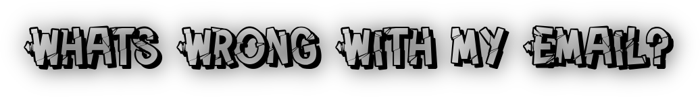

#### WWWE: What's Wrong With my Email? </br> A tool to help you check if your email(s) have appeared in a data-breach!
[](https://github.com/chrispetrou/WWWE/blob/master/LICENSE) [](https://www.python.org/) 
* * *

`WWWE.py` is a standalone python script that checks an email or a list of emails using popular online services to see it the email(s) appear on any security-breach happened in the past. The online services used are:

- [x] [HaveIBeenPwned](https://haveibeenpwned.com)
- [x] [HaveIBeenSold](https://haveibeensold.app)
- [x] [inoitsu](https://www.hotsheet.com/inoitsu/)
- [x] [LEAKEDSOURCE](https://leakedsource.ru/)
- [x] [hack check](https://www.avast.com/hackcheck/friends-check/)
- [x] [DEHASHED](https://www.dehashed.com)

```
python WWWE.py -h
usage: WWWE.py [-h] (-e  | -f )

WWWE.py: What's Wrong With my Email.

optional arguments:
  -h, --help     show this help message and exit
  -e , --email   Specify an email to check.
  -f , --file    Specify a file that contains a list of emails.
```

### Requirements:

To install the _python-requirements_ :

`pip install -r requirements.txt --upgrade --user`

But you also need to install:
*   [__Firefox__](https://www.mozilla.org/en-US/firefox/new/)
*   [__PhantomJS__](http://phantomjs.org/)
*   [__Mozilla GeckoDriver__](https://github.com/mozilla/geckodriver/releases)

### TODO
- [ ] Add the ability to save the results in csv format (_work in progress_).

### Contributions & Feedback

Feedback and contributions are welcome. If you find any bug or have a feature request feel free to open an issue, and as soon as I review it I'll try to fix it!

### Disclaimer
>This tools is only for testing and academic purposes and can only be used where strict consent has been given. Do not use it for illegal purposes! It is the end user’s responsibility to obey all applicable local, state and federal laws. Developers assume no liability and are not responsible for any misuse or damage caused by this software.

## Credits

*   Logo designed with [fontmeme.com](https://fontmeme.com/graffiti-fonts/)!

## License

This project is licensed under the GPLv3 License - see the [LICENSE](LICENSE) file for details